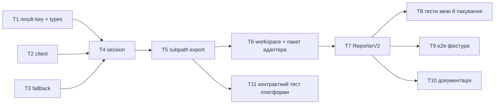

# C1-reporter-core — розбивка

> Спека: [`../spec.md`](../spec.md) · Дизайн: [`../design.md`](../design.md) ·
> План тестів: [`../test-plan.md`](../test-plan.md) · ADR: [`../adr/0001-adapter-bundles-the-core.md`](../adr/0001-adapter-bundles-the-core.md)
> Епік: `plune-ai/plune#486` (B-2)

DoD кожної задачі живе **тут**, а не в окремому файлі на задачу: одинадцять файлів по десять
рядків, які переказують цю ж таблицю, — це третє місце, яке розходиться з `tasks.json`.

## Граф

T1, T2 і T3 стартують паралельно — спільних файлів у них немає.

## Задачі

| # | Що | Шар | Залежить | AC | DoD |
|---|---|---|---|---|---|
| **T1** | `result-key.ts` + `types.ts` — дзеркало проводу типами (без zod) і детермінований ключ | domain | — | AC-04 | той самий `(testId, retry)` дає той самий ключ у двох незалежних викликах; ключ довший за 200 падає на детермінований хеш |
| **T2** | `client.ts` — `fetch`, класифікація відповідей, 3 ретраї, `Retry-After` | infra | — | AC-05 AC-06 AC-07 AC-12 | кожен клас відповіді (мережа · 429 · 5xx · 401 · 409 · 400) має тест; 429 чекає рівно `Retry-After`; токен не зустрічається в жодному рядку логу |
| **T3** | `fallback.ts` — дозапис JSONL | infra | — | AC-05 AC-12 | вбитий на середині процес лишає валідні попередні рядки; токена у файлі немає |
| **T4** | `session.ts` — `startRun` / `add` / `flush` / `finish`, буфер, мапа резолву | app | T1 T2 T3 | AC-02 AC-03 AC-08 AC-09 AC-10 AC-11 | 4 сесії з одним `externalKey` дають один `runId`; резолв викликано раз на прогін; нерезолвлений результат не відправлено; жодного `process.on('exit')` |
| **T5** | Підшлях `./reporter-core` в `exports` + окремий вхід у `tsup` | wiring | T4 | AC-13 | `require('@plune-ai/cli')` не тягне ядро; `import '@plune-ai/cli/reporter-core'` працює з `dist` |
| **T6** | Воркспейс + каркас `packages/playwright` (0 залежностей, peer `@playwright/test`) | wiring | T5 | AC-13 | `pnpm -r build` збирає обидва пакети в правильному порядку; `package.json` адаптера не має `dependencies` |
| **T7** | ReporterV2: `onBegin` → `startRun`, `onTestEnd` → `add`, `onEnd` → `flush` (+ `finish` без шардів) | app | T6 | AC-01 AC-03 AC-04 | шардований прогін не шле `finish`; `rawStatus` іде як є, `status` не заповнюється ніколи |
| **T8** | Тест межі (граматичний скан адаптера) + тест пакування | tests | T7 | AC-13 | скан падає, якщо в адаптері зʼявиться `fetch(`, `Bearer`, `/v1/`; зібраний `dist` не згадує `@plune-ai/cli` |
| **T9** | e2e: фікстурний Playwright-проєкт проти локального заглушника | tests | T7 | AC-01 | справжній `playwright test` дає один прогін `finished` і по результату на тест |
| **T10** | Документація: розділ у `docs/guide/` + README адаптера | docs | T7 | — | сторонній проєкт вмикає репортер за трьома кроками без читання коду |
| **T11** | Контрактний тест платформи проти `@plune-ai/cli` (**окремий PR у `plune-ai/plune`**) | tests | T5 | DoD епіка | форми `PendingResult` перевіряються `resultSubmissionSchema` і `batchSchema` платформи; розходження робить тест червоним |

## Порядок

T1 · T2 · T3 паралельно → T4 → T5 → T6 → T7 → далі T8 · T9 · T10 паралельно.
T11 їде окремою гілкою в іншому репозиторії, як тільки T5 опубліковано або злінковано.
